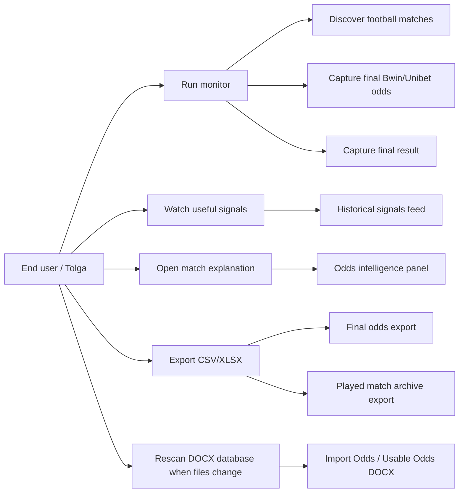
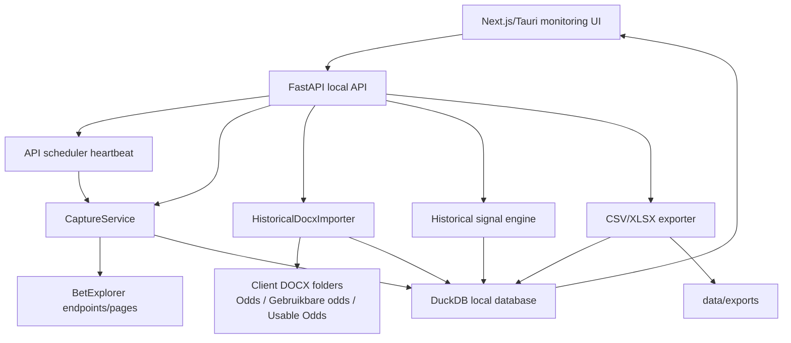
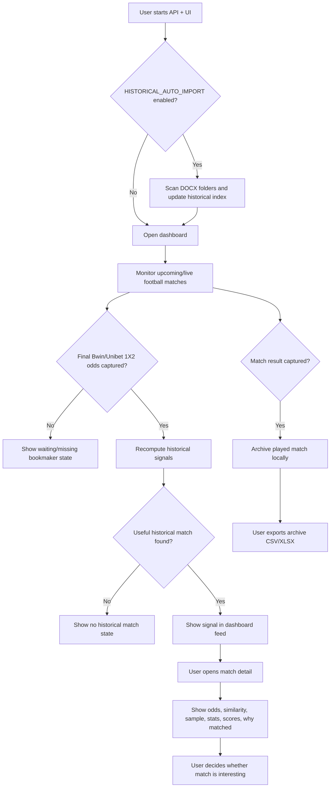
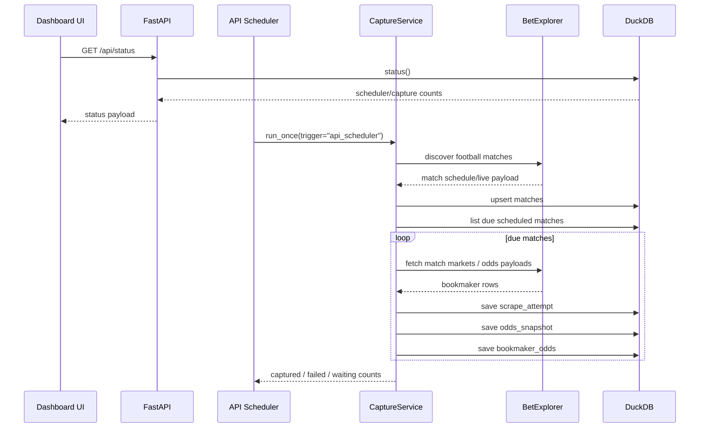
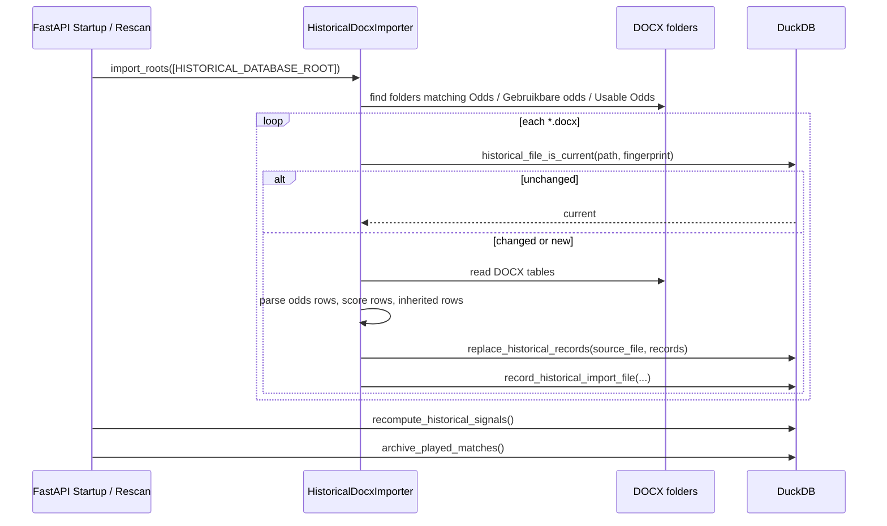
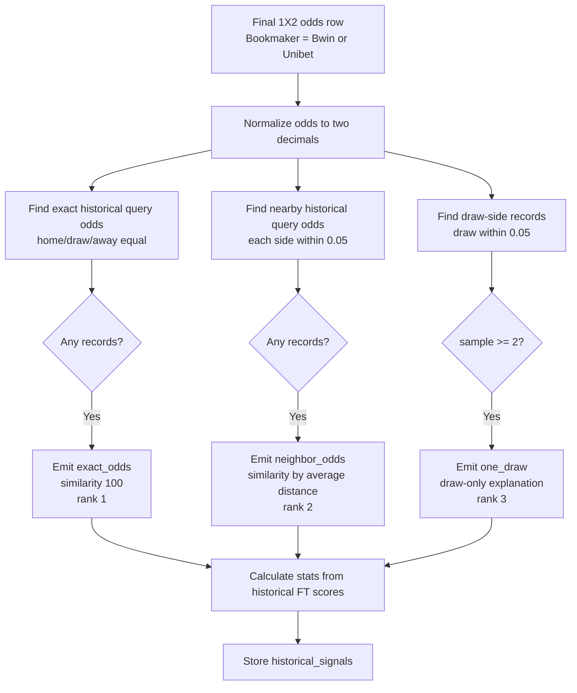
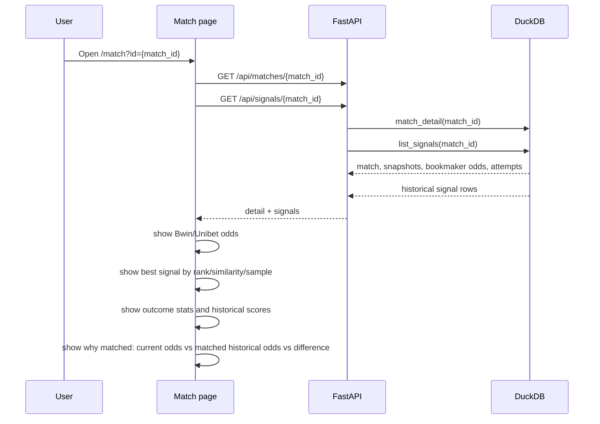
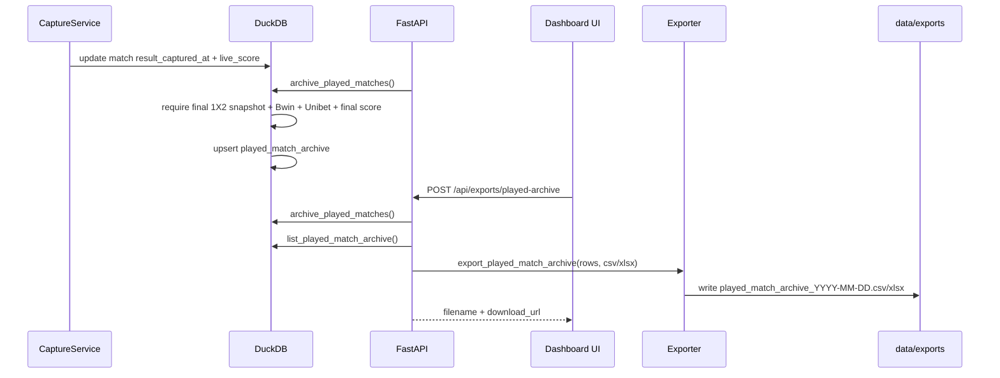
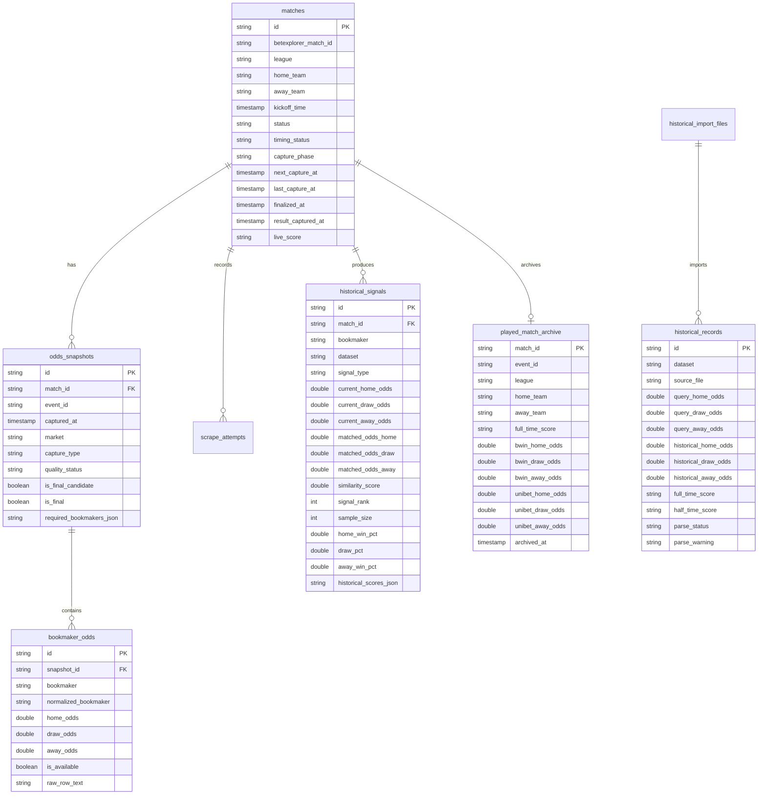
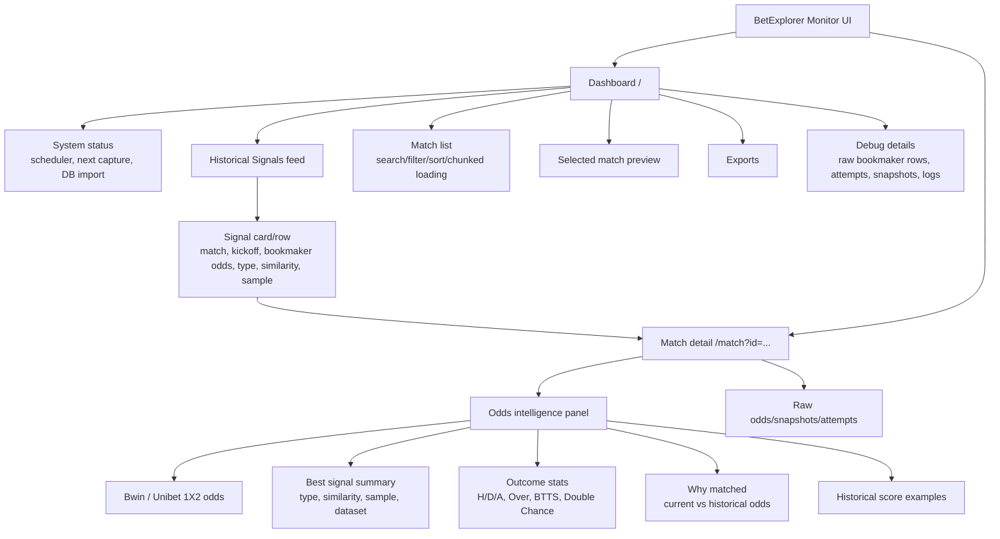

# Milestone 2 UML / Workflow Diagrams

These diagrams describe the intended end-user workflow for the BetExplorer final odds monitor with historical DOCX matching.

## 1. End-User Use Case Diagram

## 2. System Component Diagram

## 3. End-User Activity Workflow

## 4. Scheduler And Capture Sequence

## 5. Historical DOCX Import Sequence

## 6. Historical Signal Matching Activity

## 7. Match Detail Explanation Sequence

## 8. Archive And Export Sequence

## 9. DuckDB Data Model Diagram

## 10. UI Information Architecture

## UX Meaning For Figma

- Main screen should prioritize: useful signal, kickoff/time state, Bwin/Unibet availability, current odds, similarity, sample size.
- Match detail should answer: what current odds are being compared, what historical odds pattern matched, how strong the match is, and what happened historically.
- Technical data still exists but should be secondary: raw bookmaker rows, attempts, snapshots, logs, source files, parse warnings.
- DOCX files do not contain match IDs. Historical matching is odds-pattern based, not same-match-ID based.
